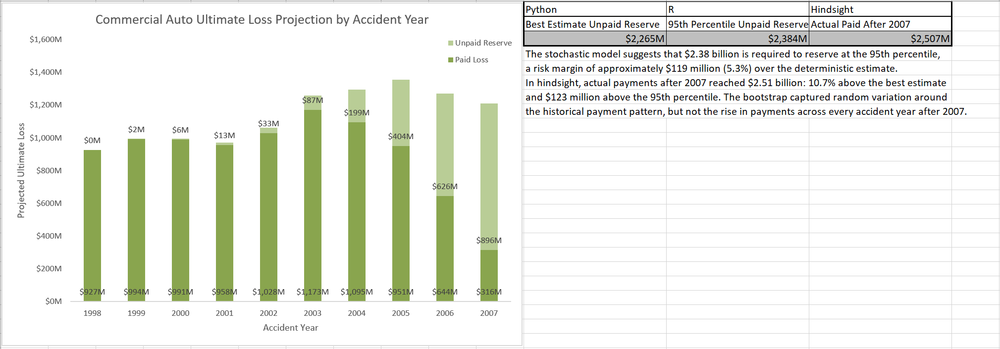

# Deterministic vs. Stochastic Loss Reserving: Commercial Auto Liability

An end-to-end property & casualty loss reserving model built on the CAS / NAIC
Schedule P database for commercial auto liability. It addresses a core insurance
question: **how much must an insurer hold in reserve today to pay future claims on
accidents that have already happened?**

The project answers this in two ways, compares them, and then checks both against
what actually happened:

- **Deterministic (Python):** the chain-ladder method gives a single best estimate.
- **Stochastic (R):** a bootstrap chain ladder simulates 1,000 possible outcomes,
  so the reserve comes with a probability distribution rather than a single number.
- **Backtest (Python and Excel):** both estimates are compared with the payments
  actually made after the valuation date.

The gap between the best estimate and the 95th percentile is the **risk margin**: the
extra capital needed to be 95% confident that the reserve is enough. The results are
presented in an Excel executive dashboard.

**Tools:** SQL (SQLite) · Python (pandas, NumPy) · R (ChainLadder) · Excel



---

## Results

Industry totals for accident years 1998–2007, valued at 31 December 2007.
Amounts in this README are in **$000s** (Schedule P is filed with $000 omitted), so
2,265,185 means about $2.27 billion. The dashboard shows the same figures in $ millions.

| | Python: chain ladder | R: bootstrap chain ladder |
|---|---:|---:|
| Unpaid reserve, best estimate / mean | 2,265,185 | 2,265,416 |
| Standard deviation | – | 71,865 |
| 75th percentile | – | 2,314,174 |
| **95th percentile** | – | **2,384,477** |

**Risk margin:** 2,384,477 − 2,265,185 = **119,292 ($000s), about $119 million or
5.3% of the best estimate.**

- The bootstrap mean differs from the chain-ladder estimate by only 231 ($000s),
  about 0.01%. That is expected, because the bootstrap is built around the
  chain-ladder model, and it confirms the Python and R implementations agree.
- The coefficient of variation is about 3.2%. That is low because 157 insurers are
  combined into one industry triangle, which smooths out company-level volatility.

### Backtest: what was actually paid

The dataset also contains the payments made after 2007, so the estimates can be
checked against what really happened.

| | $000s |
|---|---:|
| Chain-ladder unpaid reserve | 2,265,185 |
| Bootstrap 95th percentile | 2,384,477 |
| **Actually paid after 2007 (to age 10)** | **2,506,982** |

Actual payments were **10.7% above the best estimate** and **122,505 above the 95th
percentile**, and every accident year from 1999 to 2007 paid more than projected.
The bootstrap measures random variation around the historical payment pattern, but
here the pattern itself shifted. That kind of model risk is outside what a bootstrap
can capture, which is why actuaries apply judgment on top of model output.

### Chain-ladder results by accident year ($000s)

| Accident year | Paid to date | CDF to ultimate | Projected ultimate | Unpaid reserve |
|---|---:|---:|---:|---:|
| 1998 | 927,164 | 1.0000 | 927,164 | 0 |
| 1999 | 994,075 | 1.0021 | 996,143 | 2,068 |
| 2000 | 990,905 | 1.0056 | 996,442 | 5,537 |
| 2001 | 957,567 | 1.0134 | 970,400 | 12,833 |
| 2002 | 1,027,941 | 1.0320 | 1,060,808 | 32,867 |
| 2003 | 1,172,557 | 1.0740 | 1,259,371 | 86,814 |
| 2004 | 1,095,213 | 1.1817 | 1,294,224 | 199,011 |
| 2005 | 951,424 | 1.4242 | 1,355,038 | 403,614 |
| 2006 | 644,483 | 1.9718 | 1,270,796 | 626,313 |
| 2007 | 315,761 | 3.8380 | 1,211,888 | 896,127 |
| **Total** | **9,077,090** | | **11,342,275** | **2,265,185** |

### Loss development factors (volume-weighted)

| Age | 1–2 | 2–3 | 3–4 | 4–5 | 5–6 | 6–7 | 7–8 | 8–9 | 9–10 |
|---|---:|---:|---:|---:|---:|---:|---:|---:|---:|
| LDF | 1.9464 | 1.3845 | 1.2052 | 1.1003 | 1.0408 | 1.0183 | 1.0078 | 1.0035 | 1.0021 |

Only about 26% of accident year 2007 was paid by the end of its first year (CDF
3.838). The youngest accident years therefore hold most of the reserve and most of
the uncertainty.

---

## Data

- **Source:** [CAS Loss Reserving Database](https://www.casact.org/publications-research/research/research-resources/loss-reserving-data-pulled-naic-schedule-p),
  commercial auto / truck liability file `comauto_pos_98-07.csv`
- **Scope:** 157 insurers, accident years 1998–2007, development ages 1–10 (14,640 rows)
- **Measure:** `CumPaidLoss`, cumulative paid losses and allocated loss adjustment
  expenses, net of reinsurance
- **Valuation date:** 31 December 2007. Both models mask later payments so they only
  see what was known at the valuation date. The backtest then uses those later
  payments.

---

## Workflow

```
comauto_pos_98-07.csv
        │  (Python) load into SQLite
        ▼
   CommAuto.db ──────────────────────────────┐
        │  (Python) SQL → triangle             │  (R) SQL → triangle
        ▼                                      ▼
 Chain ladder: LDFs, CDFs,           Bootstrap chain ladder:
 ultimates, unpaid reserve,          1,000 simulations, percentiles
 backtest totals
        │                                      │
        └──────────────┬───────────────────────┘
                       ▼
     Commercial_Auto_Reserving_Dashboard.xlsx
     (results, bootstrap summary, backtest)
```

For a step-by-step explanation of the code, see **[CODE_DESCRIPTION.md](CODE_DESCRIPTION.md)**.

---

## Repository contents

| File | Purpose |
|---|---|
| `comauto_pos_98-07.csv` | Raw CAS Schedule P data |
| `CommAuto.db` | SQLite database created by the Python script |
| `Deterministic Auto Reserving.py` | Chain-ladder model and backtest totals (Python) |
| `Stochastic Auto Reserving.Rmd` | Bootstrap chain-ladder model (R Markdown) |
| `Stochastic-Auto-Reserving.pdf` | Knitted R output: bootstrap summary and plots, readable without R |
| `Commercial_Auto_Reserving_Dashboard.xlsx` | Executive dashboard and supporting tables |
| `requirements.txt` | Python packages (R packages listed inside) |
| `CODE_DESCRIPTION.md` | Code walkthrough |
| `images/dashboard.png` | Screenshot of the executive dashboard |

### Dashboard sheets

| Sheet | Contents |
|---|---|
| Executive Dashboard | Best estimate vs. 95th percentile vs. actual payments in hindsight, risk margin, and a paid vs. unpaid chart by accident year |
| Upper Triangle | Cumulative paid triangle known at 12/31/2007 |
| Loss Development Factors | Age-to-age factors |
| Cumulative Development Factors | Factors to ultimate |
| Results | Paid to date, CDF, projected ultimate and unpaid reserve by accident year |
| Bootstrap Summary | R bootstrap totals: mean, standard deviation, 75th and 95th percentiles |
| Backtest | Projected reserve vs. actual payments after 2007, by accident year |
| Raw Data | Source data |

---

## How to run

**Python** (run first, because it builds `CommAuto.db`):

```bash
pip install -r requirements.txt
python "Deterministic Auto Reserving.py"
```

The script prints the development factors and the backtest totals.

**R:**

```r
install.packages(c("DBI", "RSQLite", "reshape2", "ChainLadder", "openxlsx", "rmarkdown"))
rmarkdown::render("Stochastic Auto Reserving.Rmd")
```

The Excel export blocks at the end of both scripts are commented out. Re-running
them would overwrite the finished dashboard; uncomment them only to rebuild the
workbook from scratch.

---

## Notes and limitations

- **Terminology.** The model uses a *paid* triangle, so projected ultimate minus paid
  is the total unpaid reserve (case reserves + IBNR), not IBNR alone. The R
  `ChainLadder` package labels this amount "IBNR" whatever the triangle type.
- **Industry aggregate.** Combining 157 insurers produces a smooth triangle. A single
  insurer's reserve would be far more volatile, so the 5.3% risk margin does not
  transfer to an individual company.
- **No tail factor.** Development is projected to age 10. The 9–10 factor is 1.002,
  so the remaining development is small but not zero.
- **Model assumptions.** Both methods assume future payments follow the historical
  development pattern. The bootstrap captures random variation (process risk) and
  uncertainty in the factors (parameter risk), but not a change in the pattern itself
  (model risk). The backtest shows such a change happened after 2007.
- **Simulation count.** With 1,000 simulations, the 95th percentile moves by roughly
  ±10,000 ($000s) from one random seed to another.

---

## References

- Casualty Actuarial Society, *Loss Reserving Data Pulled from NAIC Schedule P*
- England, P. & Verrall, R. (2002). Stochastic claims reserving in general insurance.
  *British Actuarial Journal* 8(3)
- Gesmann, M. et al. *ChainLadder: Statistical Methods and Models for Claims Reserving
  in General Insurance* (R package)

---

*Author: Minseok Han*
